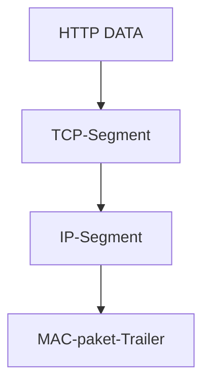

# Základy komunikace

## 3 prvky
- Zdroj
- Médium
- Cíl

## Protokol
Sada pravidel řídích komunikaci.

Musí splňovat:
- identifikaci odesílatele a příjemce
- společný jazyk a gramatiku
- rychlost načasování a doručení
- potvrzení doručení

## Síťový model
Pro zprostředkování komunikace mezi dvěmi zařízeními je nutné vyřešit více problémů (adresace, propojení atd).
Síťový model se je snaží řešit.

### ISO/OSI model
Teoretický model, co se musí řešit v sítích.
- Přijatý jako mezinárodní norma v roce 1984
- Složen ze 7 vrstev
- Každá má svoji funkcionalitu
- Sousedící vrtsvy si vyměnují informace

#### Vrstvy
1. fyzická (kabely, hardware) -> modely kabelů, porty na síťových kartách...
2. datalink (konvertuje samotné bity na data; [switch](#switch))-> rámec
3. síťové/network ([router](#router)) -> IP ([IP adresa](#ip%20adresa))
4. Transportní -> [TCP](#TCP) a [UDP](#UDP)
5. Relační -> komprese, šifrování, encoding (UTF, ASCII...)
6. Prezentační
7. Aplikační -> HTTP(S), (S)FTP(S), TFTP, SCP, SMTP, POP3, IMAP, RDP, SSH, Telnet, NTP, DHCP, DNS

### TCP/IP
Model, jak řešit sítě (používá se, funguje na něm internet).
1. Network access
2. Internet
3. Transport
4. Application

#### Enkapsulace

HTTP data (příklad, může se jednat o jiný protocol) se rozdělí na jednotlivé segmenty pro TCP, který poté přidá své informace (hlavičku, informace o paketu a pod.). Ten se poté zabalí do IP paketů, které má informace o zdrojové IP adrese, verzi a pod. Dál se zabalí celý tento IP paket do paketů pro lokální síť, které obsahují další informace (typu zdrojová MAC adresa).

Postupně si to příjemci rozbalují a zabalují znova jak je třeba.

#### MAC Adresa
Neměnná (ve VM měnitelná), určuje výrobce a identifikátor zařízení. Fyzická adresa zařízení na čipu.
Adresy jde získat přes `ifconfig` na linuxu (package `net-tools` na Arch) a Mac OS, `ipconfig` na tom horším.
- 48 bitů
- zapisována v hexadecimální soustavě (16)

#### Router
Zprostředkovává připojení k ostatním sítí (internet).
Router kam je zařízení připojené jako první je Default Gateway. Packety směrované na jiné sítě musí být směrované přes default gateway.
#### Switch
Propojuje zařízení na lokální síti.
#### IP adresa
Logická, určována routerem (DHCP) nebo jiným způsobem při připojení zařízení.
#### TCP
Spolehlivý protokol, garantuje doručení nebo informaci o nedoručení. Pomalejší než UDP.
20 byte na hlavičky.
#### UDP
Rychlý, fire-and-forget, negarantuje doručení a neinformuje o nedoručení, avšak je rychlejší a menší.
8 byte na hlavičky.